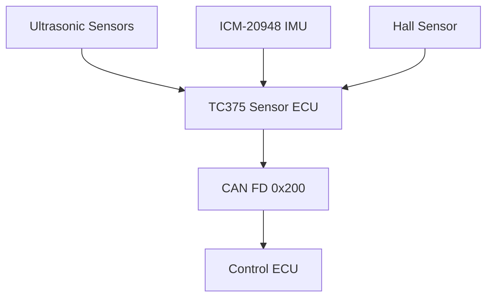

# PCA-Sensor-ECU

TC375 Lite Kit 기반 Sensor ECU 프로젝트입니다. 차량 주변 초음파 거리, IMU 기반 상대 yaw, Hall 센서 기반 차량 속도를 수집하고 CAN FD 메시지 `0x200`으로 판단 ECU에 전달합니다.

## 주요 기능

- 10채널 초음파 센서 거리 측정
- GTM TIM 기반 echo pulse width 측정
- 초음파 센서 간 간섭을 줄이기 위한 순차 발사 스케줄링
- ICM-20948 DMP Quat6 기반 yaw 계산
- 버튼 입력 기반 IMU yaw offset 재보정
- DFLASH에 yaw offset 저장 및 재부팅 후 복원
- Hall 센서 펄스 기반 차량 속도 계산
- CAN FD `0x200` 주기 송신

## System Architecture



## Hardware

| Component | Description |
|---|---|
| MCU | Infineon AURIX TC375 Lite Kit |
| RTOS | FreeRTOS |
| Ultrasonic | 10-channel one-wire ultrasonic sensors |
| IMU | ICM-20948, I2C, DMP Quat6 |
| Speed Sensor | DM2246 Hall sensor |
| Communication | CAN FD |
| Debug | ASCLIN0 UART, 115200 bps |

## Task 구성

| Task | Period / 동작 | 역할 |
|---|---:|---|
| `Ultrasonic_Run` | sensor slot 기반 | 10개 초음파 센서 순차 측정 |
| `CanApp_Run` | 100 ms | Sensor data CAN FD 송신 |
| `HallSensorApp_Run` | 1 ms | Hall pulse 감지 및 속도 계산 |
| `task_app_imu` | DMP FIFO 기반 | IMU yaw 계산 및 필터링 |
| `task_app_button` | 10 ms | BUTTON1 입력으로 IMU 재보정 요청 |
| `task_app_debug` | queue 기반 | UART debug log 출력 |
| `SchedulingStatusApp_Run` | 500 ms | FreeRTOS 동작 상태 LED toggle |

## Ultrasonic Sensor

초음파 센서는 총 10개이며, 전방 중앙을 시작으로 차량 주변을 시계방향 순서로 관리합니다.

| ID | Name | Direction |
|---:|---|---|
| 0 | `ULTRASONIC_FC` | Front Center |
| 1 | `ULTRASONIC_FR` | Front Right |
| 2 | `ULTRASONIC_RF` | Right Front |
| 3 | `ULTRASONIC_RM` | Right Middle / Behind |
| 4 | `ULTRASONIC_RR` | Rear Right |
| 5 | `ULTRASONIC_BC` | Behind Center |
| 6 | `ULTRASONIC_RL` | Rear Left |
| 7 | `ULTRASONIC_LM` | Left Middle / Behind |
| 8 | `ULTRASONIC_LF` | Left Front |
| 9 | `ULTRASONIC_FL` | Front Left |

초음파는 한 번에 모든 센서를 동시에 발사하지 않고 다음 순서로 측정합니다.

```text
FC -> BC -> FR -> RL -> RF -> LM -> RM -> LF -> RR -> FL
```

각 센서 slot은 echo wait `20 ms`와 guard time `40 ms`로 구성됩니다. 이를 통해 인접 센서 간 반사파 간섭을 줄이고, 측정값의 안정성을 높였습니다.

## Ultrasonic 상태값

| Value | Meaning |
|---:|---|
| `0xFFFB` | Out of range |
| `0xFFFC` | Not updated |
| `0xFFFD` | Stale |
| `0xFFFE` | Bad measurement |
| `0xFFFF` | Error |

## IMU Yaw

ICM-20948의 DMP Quat6 데이터를 사용해 roll, pitch, yaw를 계산합니다. 초기 보정 시 Accel Accuracy와 Gyro Accuracy가 모두 `3`이 될 때까지 기다린 뒤, 약 2초 동안 yaw 평균을 계산하여 yaw offset으로 저장합니다.

- yaw offset은 DFLASH에 저장
- 재부팅 후 저장된 yaw offset 자동 복원
- BUTTON1 입력 시 yaw recalibration 수행
- 상대 yaw는 `-180 ~ 180 deg` 범위로 정규화
- CAN 송신 전 low-pass 형태로 필터링

## Hall Sensor Speed

Hall 센서는 `P40.9`에 연결되어 있으며 active-low 방식으로 magnet detection을 수행합니다.

- update period: `1 ms`
- wheel magnets: `2`
- wheel circumference: `730 mm`
- CAN speed unit: `0.1 km/h`
- pulse timeout: `1200 ms`

펄스 간격을 기반으로 속도를 계산하고, 일정 시간 펄스가 없으면 정지 상태로 처리합니다.

## CAN FD Message

Sensor ECU는 판단 ECU로 `0x200` 메시지를 송신합니다.

- Arbitration bitrate: `500 kbps`
- Data bitrate: `2 Mbps`
- Frame type: CAN FD
- Send period: `100 ms`
- Logical payload: 23 bytes
- Transmitted DLC: 24 bytes

### `0x200` UltrasonicDistanceCmd

| Byte | Field | Type | Unit |
|---:|---|---|---|
| B0~B1 | `frontDist` | `uint16` | mm |
| B2~B3 | `frontRightDist` | `uint16` | mm |
| B4~B5 | `rightFrontDist` | `uint16` | mm |
| B6~B7 | `rightBehindDist` | `uint16` | mm |
| B8~B9 | `behindRightDist` | `uint16` | mm |
| B10~B11 | `behindDist` | `uint16` | mm |
| B12~B13 | `behindLeftDist` | `uint16` | mm |
| B14~B15 | `leftBehindDist` | `uint16` | mm |
| B16~B17 | `leftFrontDist` | `uint16` | mm |
| B18~B19 | `frontLeftDist` | `uint16` | mm |
| B20~B21 | `imuYaw` | `sint16` | deg |
| B22 | `vehicleSpeed` | `uint8` | 0.1 km/h |
| B23 | padding | - | - |

## Repository Structure

```text
.
├── Cpu0_Main.c
├── Apps
│   ├── App_Ultrasonic
│   ├── App_IMU
│   ├── App_HallSensor
│   ├── App_Can
│   ├── App_CalibStorage
│   ├── App_Button
│   ├── App_Debug
│   └── App_SchedulingStatus
├── Drivers
│   └── Can
├── OS
│   └── FreeRTOS
├── Libraries
│   ├── iLLD
│   └── ICM20948
└── Configurations
```

## 구현 포인트

이 프로젝트는 여러 센서 입력을 FreeRTOS task로 분리하고 CAN FD payload로 통합한 Sensor ECU입니다.

특히 초음파 센서는 순차 발사와 guard time을 적용해 반사파 간섭을 줄였고, IMU는 yaw offset을 DFLASH에 저장해 재부팅 후에도 기준 방향을 유지하도록 구현했습니다. Hall 센서는 pulse interval 기반 속도 계산, glitch filtering, timeout 기반 정지 처리를 포함합니다.

## 개선 가능 항목

- 초음파 센서별 timeout 및 fault counter 추가
- CAN 송신 payload endian 명시 및 packing 고정
- IMU yaw drift 장시간 테스트
- Hall 센서 속도값 moving average 적용
- Sensor ECU 상태 진단 메시지 추가
